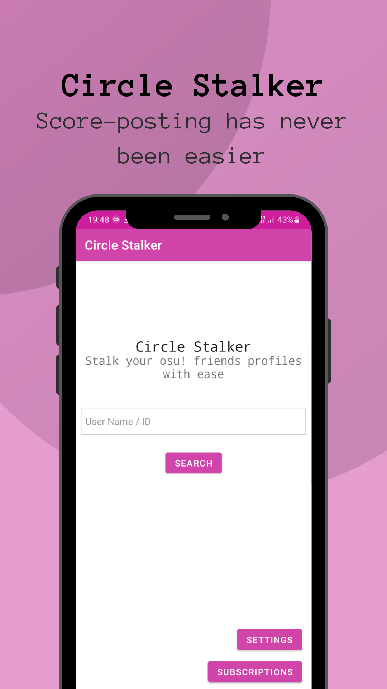
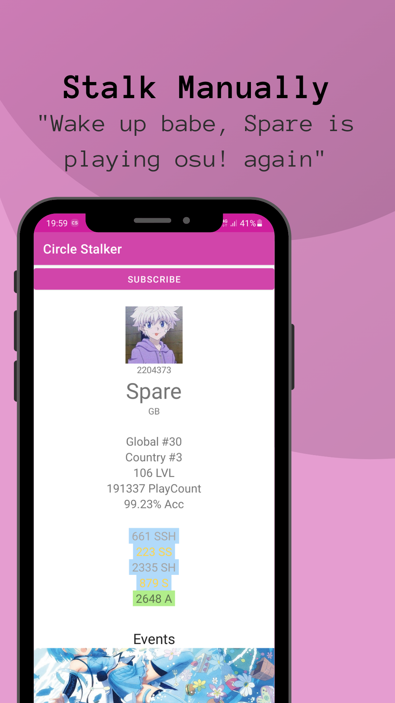
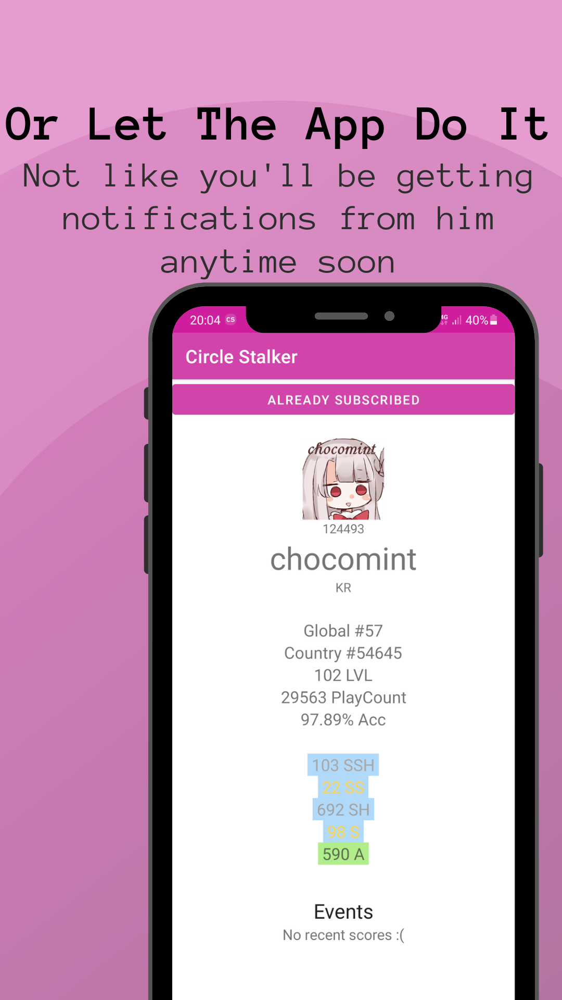
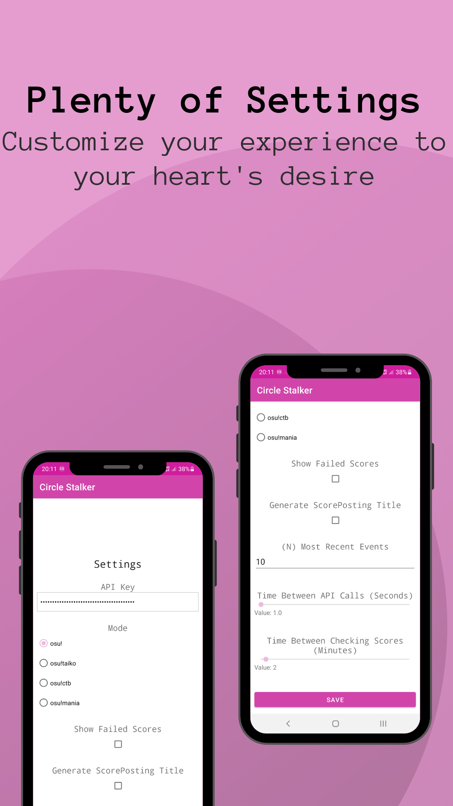

## Circle Stalker
> by u/ZenT3600

---

### What is Circle Stalker?

Circle Stalker is an app aimed to help osu!scoreposter have an easier time keeping in touch with their favourite players.

### ...and how does it do that?

The app uses and osu!api v1 key, provided by the user, to scan a series of players' profiles the user wants to keep in touch with and notifies them with a push notification whenever a new score appears.

This all happens following to the TOS of the osu!api and the scanning happens every few minutes, giving you lighting fast updates

### Too many big words, keep it simple

Alright, alright. When opening the app you'll be able to search for osu! players and subscribe to them. If any of those users decide to start playing osu! and set some plays you will get notified within a matter of minutes

### I'm sold. How do I get the app?

If you choose to try out Circle Stalker you can download an APK release in the [releases page](https://github.com/ZenT3600/CircleStalker/releases/latest)
